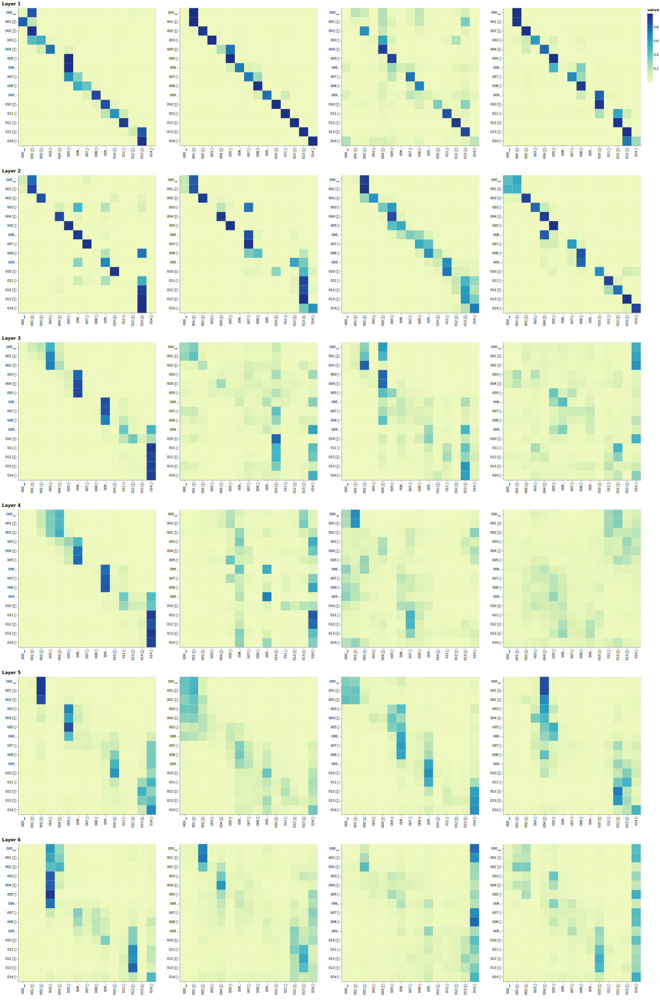
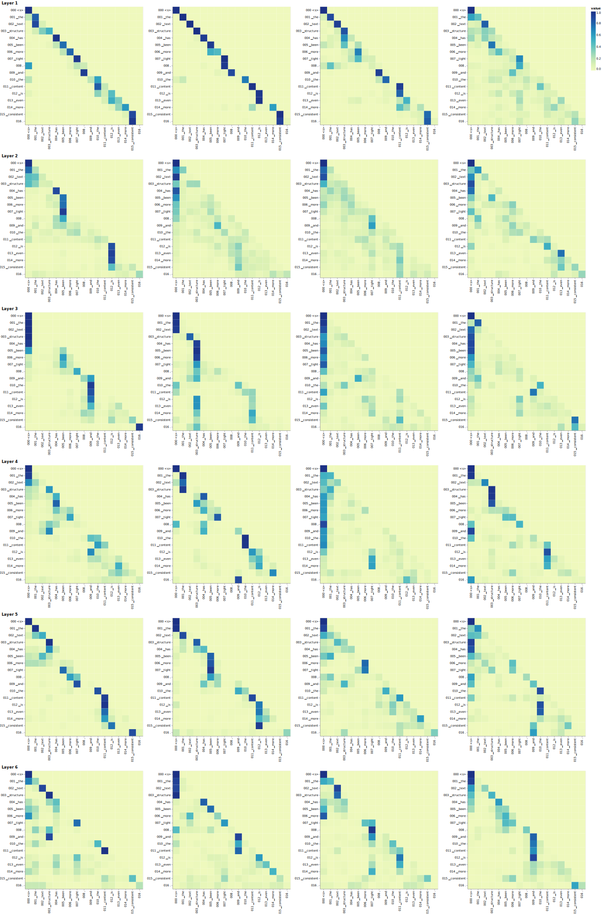
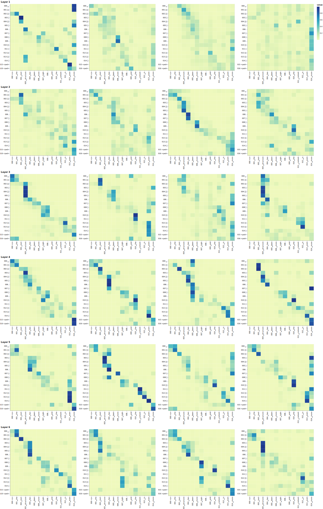

# transformer

手动实现transformer，通过汉译英数据集训练与测试

代码对应的文章地址为 https://zhuanlan.zhihu.com/p/642454398

# 1. 安装依赖包

通过requirements.txt 安装所需的依赖库
```
pip install -r requirements.txt
```

# 2. 模型训练

通过命令以下训练
```
python train.py
```

# 3. 模型测试

执行以下命令，可以对测试集进行beam_seach解码，并计算BLEU。

```
python test.py
```

# 4. Attention可视化

通过visualization.ipynb 实现以下Attention 矩阵可视化效果

Encoder Self-Attention




Decoder Self-Attention



Decoder Cross-Attention




